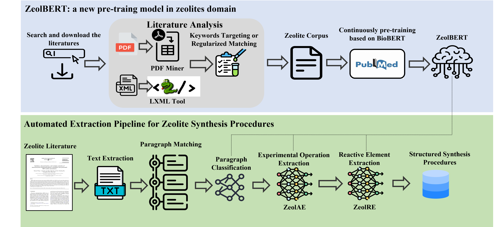

# ZeolBERT: Automated Extraction Pipeline for Zeolite Synthesis Procedures

**Paper Title:**
**Automated Extraction Pipeline of Zeolite Synthesis Procedures from Scientific Literature Using ZeolBERT, a Domain-Adapted Pre-trained Language Model**

## Overview

Accurate synthesis procedures are critical for exploring the relationships between synthesis conditions and zeolite properties. Manual extraction from scientific literature, however, is labor-intensive and impractical due to the rapid growth of publications. To address this, we introduce **ZeolBERT**, a specialized pre-trained language model adapted to the zeolite domain.

ZeolBERT is trained on a zeolite-specific corpus comprising 99 million tokens from approximately 16,000 scientific articles, starting from BioBERT parameters. We propose an automated extraction pipeline with four key stages:

1. **Literature Analysis**
2. **Paragraph Classification**
3. **Experimental Operations Extraction (ZeolAE)**: Utilizes Conditional Random Fields (CRF) to effectively model sequential labeling.
4. **Reactive Elements Extraction (ZeolRE)**: Integrates CRF and Conditional Layer Normalization (CLN) to enhance conditional encoding and minimize error propagation.

ZeolBERT outperforms existing models by achieving:

* **1.65%** increase in accuracy.
* **3.92-point** improvement in F1-score for entity recognition.

Overall, variations of ZeolBERT in our pipeline exhibit average F1-score improvements of 3.12, 0.64, and 1.53 across different tasks, demonstrating its substantial potential for NLP tasks within the zeolite research community.

## Pipeline Architecture



## Installation

### Requirements

* PyTorch (≥1.5.0)
* Transformers (tested on v3.0.2)
* tqdm (≥4.36.0)
* numpy (≥1.18.0)
* seqeval

Install dependencies via:

```bash
pip install torch transformers tqdm numpy seqeval
```

## Data and Pre-trained Models

### Datasets

Available on Kaggle:

* [Original Dataset for ZeolBERT](https://www.kaggle.com/datasets/boldhu/original-dataset-for-zeolbert)

### Pre-trained Models

Download and place the models in `./pretrained_model/bert-base-cased`:

* [Pre-trained Model and Fine-tuned Models](https://www.kaggle.com/datasets/boldhu/original-dataset-for-zeolbert)

## Usage

### Training

Run training with specific configuration:

```bash
python train.py <task> <config_path>
```

* `<task>`: Choose between experimental operations (`zeolae`) or reactive elements extraction (`zeolre`).
* `<config_path>`: Path to JSON configuration file.

**Example:**

```bash
python train.py zeolae configs/zeolae_train.json
```

### Prediction

Perform predictions on unlabeled data:

```bash
python predict.py <task> <config_path>
```

**Example:**

```bash
python predict.py zeolae configs/zeolae_predict.json
```
